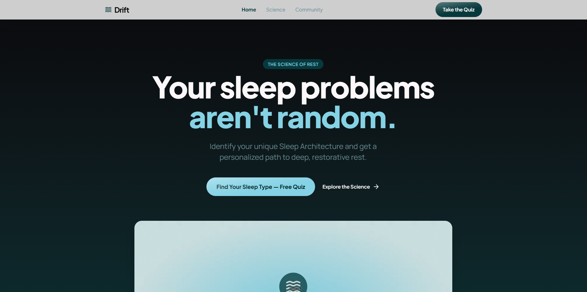

# Drift — Quick Sleep Diagnosis Quiz Funnel

A demo quiz funnel landing page for "Drift", a sleep diagnosis product. Users take a personalized sleep quiz and purchase a 21-day sleep protocol via Stripe checkout integration.



## Getting Started

### Prerequisites

- Node.js 18+
- A Stripe account (for checkout integration)

### Installation

```bash
npm install
```

### Environment Variables

Create a `.env.local` file in the root directory:

```env
NEXT_PUBLIC_STRIPE_PUBLISHABLE_KEY=your_stripe_publishable_key
STRIPE_SECRET_KEY=your_stripe_secret_key
```

### Run the Development Server

```bash
npm run dev
```

Open [http://localhost:3000](http://localhost:3000) to view the app.

### Testing the App

1. Browse the landing page at `/`
2. Click "Take the Quiz" or "Find Your Sleep Type" to start the quiz at `/quiz`
3. Complete the quiz to see your personalized results at `/results`
4. Proceed to checkout at `/checkout` (use Stripe test card `4242 4242 4242 4242`)
5. View the success page at `/success` after payment
